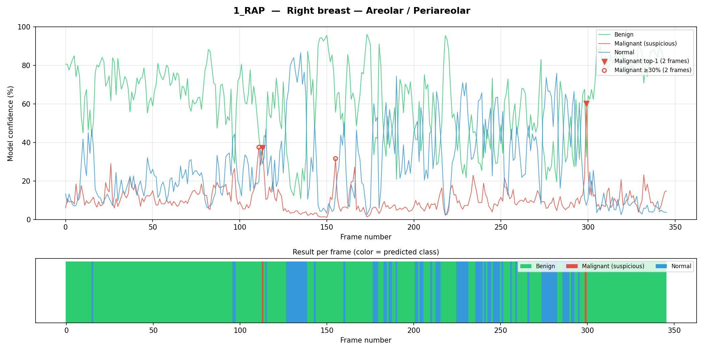
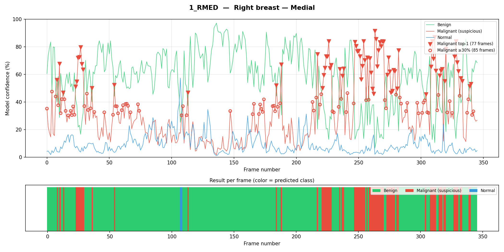
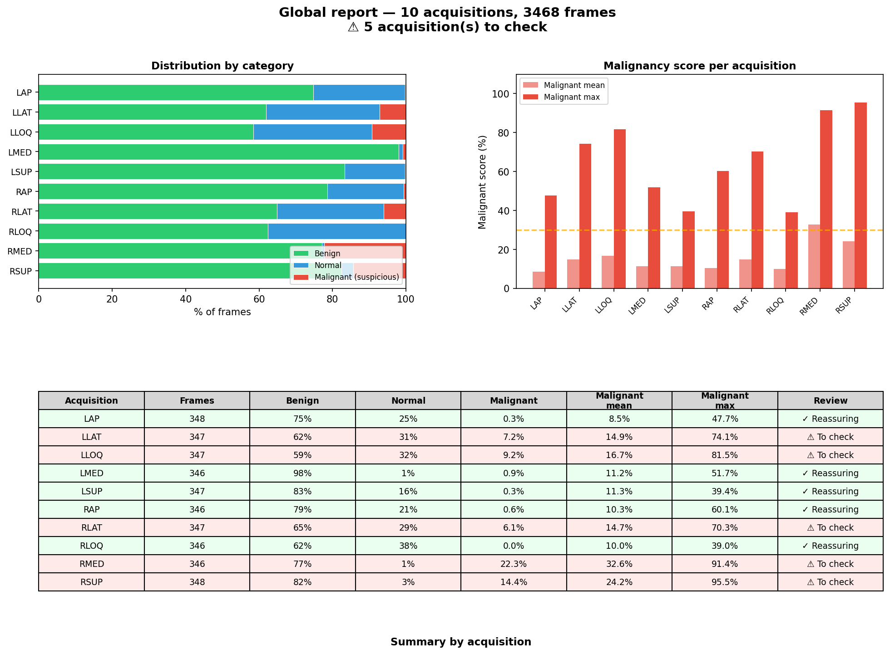

# AI-Powered Ultrasound Video Analysis


This project provides a pipeline for automatic analysis of ultrasound video sequences using artificial intelligence. It enables:
- Preprocessing of medical videos (DICOM)
- Frame-by-frame image classification with a deep model
- Generation of detailed clinical reports and visualizations

**Clinical workflow:**
1. Extract frames from DICOM ultrasound videos
2. Classify each frame (e.g., benign, malignant, normal) using a ViT model
3. Detect suspicious sequences (e.g., ≥3 consecutive malignant frames)
4. Generate per-acquisition and global reports (text + figures)
5. Review results for clinical decision support (radiology/oncology)


> **Example use case: breast ultrasound analysis**


## Project Structure
```
mammaus/              # Core package
    __init__.py
    constants.py
    predict.py        # Frame classification + per-acquisition reports
    preprocess.py     # DICOM → PNG extraction
    reporting.py      # Figures, statistics, global report
    MODEL.txt         # Model card (architecture, classes, limitations)
tests/                # Unit tests (pytest)
pyproject.toml        # Build config, entry points, dev tools
requirements.txt
README.md
```

## Pipeline Overview

Pipeline Overview:

    DICOM Ultrasound Video
    |
    v
    Preprocessing (PNG extraction)
    |
    v
    AI Classification (per frame)
    |
    v
    Save Scores (per acquisition)
    |
    +-----------+------------+
    |                        |
    v                        v
    Per-acquisition   Global Report
    Reports & Figures (summary, figure)
    |                        |
    +-----------+------------+
    |
    v
    Physician Clinical Review


## Installation
Clone the project, then
```bash
cd mammaus
pip install -e ".[dev]"
```

`[dev]` includes testing and linting tools (`pytest`, `ruff`).
For usage only, classical installation is sufficient.
```bash
pip install -e .
```


## Usage
### 1. DICOM → PNG Preprocessing
```bash
mammaus-preprocess /path/to/dicom_folder_or_file
```

### 2. AI Prediction on All Frames
```bash
mammaus-predict preprocessed/
```

### 3. Global Report
```bash
mammaus-report
```


## Example Output

### Per-acquisition report (excerpt)
```
═══════════════════════════════════════════════════
  1_RAP  —  Right breast — Areolar / Periareolar
  346 frames analyzed
═══════════════════════════════════════════════════

RESULT BY CATEGORY
------------------
    Benign :  272 / 346 frames (78.6%)  
    Malignant (suspicious) :    2 / 346 frames (0.6%)
    Normal :   72 / 346 frames (20.8%)

GENERAL ASSESSMENT (automatic heuristic)
----------------------------------------
  ✓  RESULT: OVERALL REASSURING
  2 frame(s) classified as malignant but isolated,
  without a consecutive sequence ≥ 3 — likely outliers.
```

### Global report summary (excerpt)
```
SUMMARY BY ACQUISITION
----------------------
Acquisition Frames Benign Normal Malignant MaligMean MaligMax Review
--------------------------------------------------------------------
1_RAP       346    79%    21%    0.6%      10.3%      60.1%   Reassuring
1_RMED      346    77%     1%    22.3%     32.6%      91.4%   TO CHECK
...

⚠ 5 acquisition(s) require review (consecutive malignant frames detected).
```

### Per-acquisition figures
Each acquisition produces a confidence plot + per-frame color bar:




This could give the user clues to identify key images 
or sub-sequences in ultrasound videos.

### Global report figure


This could give the user clues to identify key part of the 
full ultrasound exam.

## Testing
```bash
pip install -e ".[dev]"
python -m pytest tests/ -v
```


## Adapting to Other Applications
Replace the AI model (ViT, ResNet, etc.) in `predict.py` and MODEL.txt


## Provided Example: Breast Ultrasound
- Model: HuggingFace ViT (breast-cancer-detector-2)
- 3 classes: benign, malignant, normal
- See [MODEL.txt](mammaus/MODEL.txt) for the full model card


## License
Apache 2.0

## Authors
Thibault Escobar, 2026

---

## Limitations and Future Improvements

- **Parameterization**: The threshold for consecutive malignant frames (default: 3), the malignant confidence threshold (default: 30%), and the model are hard-coded. Making these parameters configurable via CLI would improve flexibility.
- **Error Handling**: While the code handles missing files and format issues, more detailed logging and exception management would help for production use.
- **Performance**: For very large datasets, parallelization of preprocessing and prediction could be considered. Easy to implement if needed with dedicated lib such as Ray or Joblib.

If you have suggestions or want to contribute improvements, feel free to open an issue or pull request.
